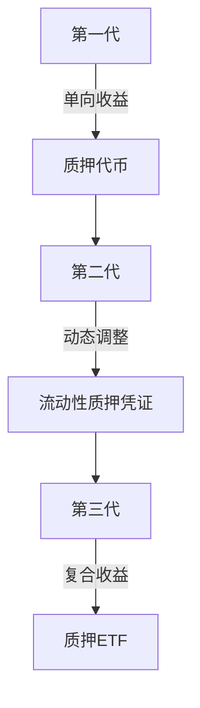

# Solana价格下跌：美国质押ETF未达预期，市场前景仍乐观

## Solana质押ETF正式上线，市场反应超预期冷静

2025年7月2日，REX-Osprey推出的首支美国Solana质押ETF（代码SSK）正式上线交易。尽管该产品首次将质押收益机制引入传统金融体系，但Solana原生代币SOL当日仍下跌7.84%至145.08美元。这一现象引发市场对新型加密金融产品的深度思考。

### 创新性产品结构解析
该ETF采用独特的双轨制资产配置：
```markdown
| 资产类别       | 配置比例 | 说明                     |
|----------------|----------|--------------------------|
| SOL基础持仓    | 80%      | 直接持有Solana代币       |
| 质押代币       | 50%      | 参与网络验证获取年化收益 |
| 流动性储备金   | 20%      | 应对赎回需求             |
```

与传统ETF仅追踪价格不同，该产品开创性地将质押收益纳入收益结构。根据产品说明书，投资者可通过季度分红获得约3-5%的年化收益。

👉 [了解更多加密金融创新产品](https://bit.ly/okx_welcome)

### 监管框架突破性意义
该ETF选择依据1940年《投资公司法》注册而非更严苛的1933年法案，这一策略带来双重优势：
1. 更快的监管审批流程
2. 更完善的投资者保护机制

Grayscale、VanEck等头部机构已提交类似产品申请，预示着新一轮加密ETF创新浪潮即将到来。

## 网络基本面持续向好

### 用户增长创历史新高
截至6月28日，持有0.1 SOL及以上的钱包地址数突破1144万大关，较年初增长42%。这一数据与SOL价格在150.76美元的高点形成共振，显示底层用户基础持续扩大。

👉 [查看实时加密货币数据](https://bit.ly/okx_welcome)

### 资金流动呈现积极信号
7月1日数据显示：
- 中心化交易所净流出5.2532亿美元
- 私人钱包持仓占比提升至63%
- 鲸鱼账户新增23个百万美元级地址

这种"越跌越买"的格局预示市场对短期波动的理性应对，长期持币者正在吸收短期抛压。

## 衍生品市场暗藏爆发潜力

### 期货交易量激增
| 指标         | 当日数据    | 环比涨幅  | 历史分位 |
|--------------|-------------|-----------|----------|
| 交易量       | 202.4亿美元 | +88.74%   | 92%      |
| 未平仓量     | 72.2亿美元  | +4.14%    | 85%      |
| 多空比       | 1.9842      | 突破警戒线| -        |

Binance和OKX的极端多头比例（1.9842/2.16）显示机构投资者正积极布局潜在反弹行情。

### 技术分析揭示关键支撑位
当前价格形态呈现多重看涨信号：
1. 短期：形成标准上升三角形，颈线位144.87美元
2. 中期：突破下降趋势线后目标价181-244美元区间
3. 长期：周线级别MACD底背离形态初现

若价格守住139.88美元关键支撑位，理论上涨空间可达27%至184.88美元。

## 行业发展路径分析

### 质押经济模式革新
Solana的质押机制已演进至第三代：


这种演变使普通投资者参与门槛从最低1 SOL降至0.001 ETH当量，极大地拓展了市场参与度。

### 监管科技（RegTech）突破
新产品引入三大创新机制：
1. 零知识证明验证系统：确保链上数据可审计性
2. 自动化合规引擎：实时匹配全球监管要求
3. 跨链清算系统：支持多资产即时结算

这些技术突破为后续比特币、以太坊ETF升级提供技术范式。

## 常见问题解答

Q: **为什么ETF上市反而导致价格下跌？**
A: 市场提前消化利好消息，部分投资者选择获利了结。同时新型产品需要时间被主流投资者认知，短期波动属于正常市场行为。

Q: **质押ETF与普通ETF的核心差异是什么？**
A: 除价格跟踪功能外，质押ETF通过参与网络验证获取额外收益，理论上可提升年化回报3-5个百分点。

Q: **当前价格形态是否可靠？**
A: 技术指标显示：1）RSI底背离已形成；2）布林带极度压缩；3）成交量呈现"下跌缩量、上涨放量"特征，多重信号增强形态可信度。

Q: **机构投资者如何参与质押ETF？**
A: 通过授权参与机制：1）大宗交易直接申购；2）链下托管服务；3）定制化收益分配方案。最小参与门槛为50万美元等值。

Q: **Solana生态发展现状如何？**
A: 生态项目突破1.2万个，日均活跃开发者达287人，DeFi总锁仓量回升至18亿美元，显示底层生态活力持续增强。

## 未来展望

随着现货与衍生品市场的深度联动，Solana正构建完整的价值捕获体系。从技术演进看，即将升级的Quic协议将使网络吞吐量提升至12万TPS，进一步巩固其高性能公链优势。监管层面，美国证券交易委员会（SEC）已启动加密资产分类监管框架测试，为行业规范化发展铺平道路。

👉 [探索高性能区块链生态](https://bit.ly/okx_welcome)

市场参与者应重点关注：
- 7月关键宏观经济数据发布时间窗口
- 9月美联储议息会议政策指引
- 10月Solana开发者大会技术路线图

在合规框架与技术创新的双重驱动下，Solana有望成为连接传统金融与加密世界的桥梁，其价值发现过程将持续演绎。