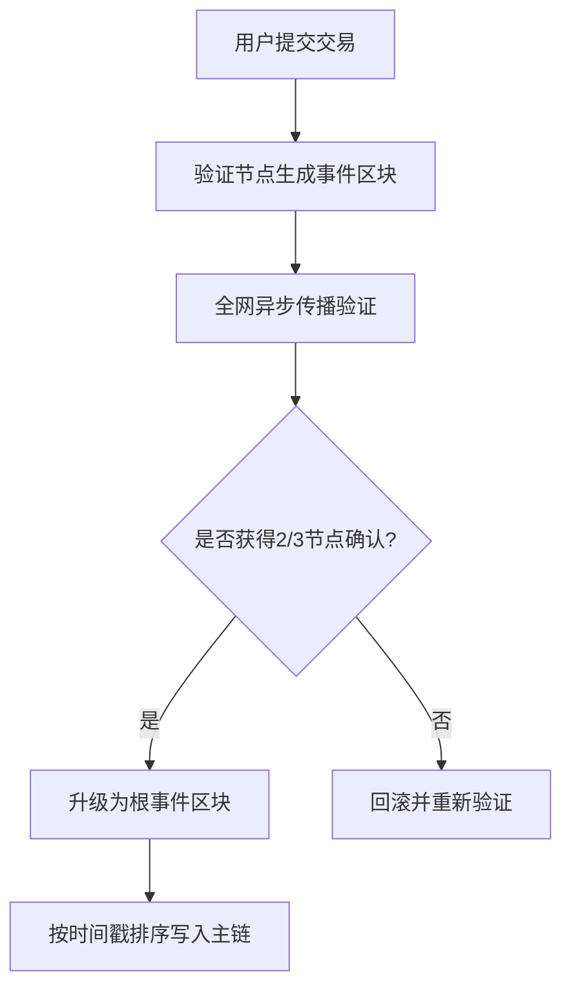

# Sonic区块链共识机制详解：ABFT与DAG的创新融合

区块链技术的核心在于其共识机制，这是确保分布式系统安全性和一致性的基石。Sonic区块链通过创新性地结合**异步拜占庭容错**（ABFT）与**有向无环图**（DAG）技术，在保证安全性的同时实现了超高速交易处理能力。本文将深度解析Sonic如何突破传统区块链的性能瓶颈。

---

## 共识机制的演进：从PBFT到ABFT

### 传统PBFT的局限性
实用拜占庭容错（PBFT）作为早期主流共识算法，通过多轮消息传递实现节点共识，但存在两大痛点：
1. **线性验证瓶颈**：所有节点需按序验证区块，导致高并发场景下性能下降
2. **Sybil攻击风险**：缺乏经济惩罚机制，易受节点数量攻击

比特币通过工作量证明（PoW）引入算力成本，以太坊转向权益证明（PoS）则通过质押机制解决这些问题。Sonic在此基础上更进一步，采用**异步拜占庭容错**（ABFT）实现革命性突破。

### ABFT的突破性创新
Sonic的ABFT机制具有三大核心特征：
- **并行验证**：节点可独立验证交易，无需等待其他节点确认
- **异步通信**：交易数据通过非阻塞式网络传输，消除顺序依赖
- **DAG拓扑结构**：事件区块以有向无环图形式存储，突破线性链式结构限制

这种架构使网络吞吐量提升5-10倍，最终确认时间压缩至1-2秒。

---

## DAG技术的革命性应用

### DAG数据结构解析
| 特性          | 传统区块链 | Sonic DAG   |
|---------------|------------|-------------|
| 数据结构      | 线性链式   | 有向无环图  |
| 验证顺序      | 严格有序   | 异步并行    |
| 存储效率      | O(n)       | O(log n)    |
| 网络延迟敏感度| 高         | 低          |

### 事件区块的工作原理
1. **交易打包**：验证节点将交易聚合成事件区块
2. **多维验证**：每个新区块需验证本地交易及网络同步数据
3. **拓扑传播**：通过异步通信将区块广播至全网
4. **共识收敛**：当超过2/3节点确认后，区块升级为根事件

👉 [深度解析区块链共识算法](https://bit.ly/okx_welcome)

---

## Sonic共识机制的运行流程

### 四阶段交易处理

### 性能优势对比
| 指标          | Bitcoin  | Ethereum 2.0 | Sonic       |
|---------------|----------|--------------|-------------|
| TPS           | 7        | 30           | 3,000+      |
| 最终确认时间  | 10分钟   | 12-15秒      | 1-2秒       |
| 能源效率      | 低       | 中           | 极高        |
| 网络可扩展性  | 弱       | 一般         | 强          |

---

## FAQ：常见问题解答

### Q1：ABFT与传统PBFT有何本质区别？
ABFT通过异步通信和DAG存储结构，解决了PBFT的线性验证瓶颈。在Sonic网络中，验证节点无需等待全局共识即可处理交易，极大提升了并发处理能力。

### Q2：DAG如何确保数据一致性？
每个事件区块包含：
- 交易数据
- 父区块哈希
- 时间戳
- 节点签名
通过拓扑排序算法确保所有节点最终达成全局一致状态。

👉 [探索区块链技术的未来趋势](https://bit.ly/okx_welcome)

### Q3：Sonic如何防范51%攻击？
采用PoS机制要求攻击者必须持有超过1/3的代币质押量，配合ABFT的容错特性，使得攻击成本呈指数级上升。

---

## 技术演进与生态展望

Sonic的共识机制已通过以下方式实现突破：
1. **理论创新**：基于Lachesis协议改进的异步验证模型
2. **工程优化**：采用流水线式区块传播机制
3. **生态扩展**：兼容EVM的智能合约平台支持

该技术已在DeFi、NFT、Web3基础设施等领域展现强大潜力，未来将重点发展以下方向：
- 跨链互操作性协议
- 零知识证明集成
- 分片技术升级

👉 [立即体验高速区块链生态](https://bit.ly/okx_welcome)

---

通过ABFT与DAG的深度融合，Sonic成功构建了兼顾安全性、可扩展性和去中心化的下一代区块链架构。这种创新性设计不仅解决了现有公链的性能瓶颈，更为Web3.0时代的应用落地提供了坚实基础。