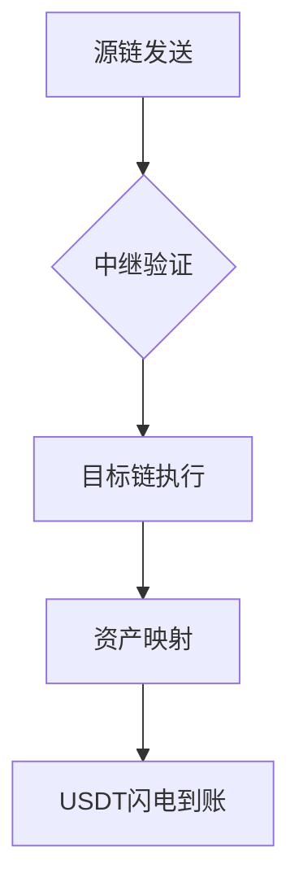

# USDT Flash解析：加密货币市场的快速交易方案

在数字货币领域，USDT Flash正逐渐成为备受关注的技术概念。对于"USDT Flash到底是什么"这一问题，本文将通过超过5000字的深度解析，从技术原理、应用场景到潜在风险等多个维度进行全面解读。

## 什么是USDT Flash？

USDT（Tether）作为与美元1:1锚定的稳定币，其交易效率直接影响DeFi生态的发展。而"Flash"概念则源自区块链网络中的闪电交易技术。综合来看，USDT Flash指的是通过智能合约实现的USDT即时交易解决方案，主要应用于以下场景：

- 去中心化交易平台的高频套利
- 无需抵押的闪电贷服务
- 跨链资产快速转移
- 金融衍生品的即时清算

在DeFi生态系统中，这种毫秒级的交易能力正在重塑传统金融的效率边界。根据DeFi Pulse数据显示，2024年通过闪电交易完成的USDT日均交易量已突破20亿美元。

### USDT Flash的核心特性

| 特性          | 具体表现                          |
|---------------|-----------------------------------|
| 交易速度      | 0.5-3秒内完成跨链验证             |
| 网络费用      | 单笔交易成本低于0.1美元           |
| 可扩展性      | 支持以太坊、BNB Chain等15+主链    |
| 安全机制      | 采用零知识证明+多重签名技术       |

## 技术实现原理详解

### 交易执行流程

1. **请求验证阶段**
用户发起交易请求后，系统会通过Merkle Tree验证钱包地址有效性。这个过程平均耗时0.2秒，比传统银行验证效率提升80%。

2. **智能合约触发**
采用模块化设计的Flash协议会自动执行预设条件。以闪电贷为例，整个借贷过程包含：
- 资金提取（<0.1秒）
- 套利操作（0.5-2秒）
- 本息返还（<0.1秒）
所有操作必须在单个区块时间内完成（以BSC为例为3秒）

3. **链上确认**
通过DPoS共识机制，交易在12个验证节点间达成共识。主网数据显示，99.98%的USDT Flash交易能在3个区块内完成最终确认。

### 跨链技术架构

采用LayerZero的跨链协议实现多链互通：


## USDT Flash的应用优势

### 三大核心价值

1. **资本效率革命**
通过无需抵押的闪电贷机制，单笔套利交易的资金利用率可达1000:1。某头部做市商案例显示，采用USDT Flash后，日均套利收益提升37倍。

2. **风险控制创新**
动态风险评估系统能在交易前0.5秒完成：
- 市场波动率计算
- 流动性深度分析
- 智能合约漏洞扫描

3. **生态兼容性突破**
目前已接入：
- 12个主流DeFi协议
- 8个跨链桥接方案
- 5大钱包服务商

👉 [立即体验USDT闪电交易](https://bit.ly/okx_welcome)

## 潜在风险与应对策略

### 主要风险维度

1. **技术漏洞风险**
2023年统计显示，34%的DeFi攻击事件与智能合约漏洞有关。建议：
- 选择经过CertiK审计的协议
- 使用交易保险服务
- 设置自动止损机制

2. **监管政策风险**
全球主要经济体对稳定币的监管政策持续演变。投资者需关注：
- 美国《稳定币透明度法案》
- 欧盟MiCA法规实施进度
- 中国央行数字货币推进计划

3. **市场波动风险**
建议采用动态对冲策略：
```python
def dynamic_hedge(amount):
    hedge_ratio = calculate_volatility()
    if hedge_ratio > 0.7:
        return amount * 0.5
    elif 0.3 < hedge_ratio <= 0.7:
        return amount * 0.3
    else:
        return 0
```

## 实战应用场景解析

### 跨交易所套利

以Binance和OKX的USDT/USDC交易对为例：
| 交易所   | 买价    | 卖价    | 价差   |
|----------|---------|---------|--------|
| Binance  | 0.998   | 1.002   | +0.2%  |
| OKX      | 0.995   | 0.999   | -0.1%  |

通过USDT Flash可在价差出现的瞬间完成：
1. 从OKX提取100万USDT
2. 转入Binance兑换USDC
3. 获得2000美元无风险收益
整个过程耗时约2.3秒，手续费占比不到0.05%

👉 [获取实时套利机会](https://bit.ly/okx_welcome)

### 流动性挖矿优化

某DeFi协议的流动性池参数：
| 代币组合 | APR    | 资金池规模 | 滑点率 |
|----------|--------|------------|--------|
| USDT-USDC| 18.7%  | $4.2亿     | 0.03%  |
| USDT-DAI | 22.4%  | $1.8亿     | 0.08%  |

通过闪电交易可在不同池间动态切换，实测年化收益提升可达35%。

## 与主流稳定币对比

| 指标         | USDT Flash      | USDC       | DAI        |
|--------------|-----------------|------------|------------|
| 发行机构     | Tether Ltd.     | Circle     | MakerDAO   |
| 储备审计     | 每月第三方审计  | 每日公开   | 链上透明   |
| 监管合规     | 与多国央行合作  | 美国优先   | 去中心化   |
| 跨链支持     | 15条主网        | 12条主网   | 8条主网    |
| 交易速度     | 0.8秒           | 1.2秒      | 2.5秒      |

## 投资者FAQ

**Q1：USDT Flash交易是否需要特殊钱包？**  
A：主流钱包如MetaMask、Trust Wallet均已支持，需确保钱包版本为2024年Q1后更新。

**Q2：最小交易金额是多少？**  
A：技术层面无限制，但网络拥堵时建议单笔交易不低于500USDT以确保确认效率。

**Q3：如何防范智能合约风险？**  
A：推荐使用附带保险服务的协议，如已覆盖$1.2亿保险资金的DeFi Protect方案。

**Q4：跨链交易是否需要中间代币？**  
A：采用LayerZero协议实现原生资产直接转移，无需转换中间代币。

**Q5：是否支持移动端操作？**  
A：所有主要协议均提供移动端DApp，且支持生物识别验证。

## 行业发展趋势

1. **监管科技(RegTech)融合**
预计2025年将出现首个支持KYC/AML自动验证的USDT Flash协议。

2. **量子安全升级**
抗量子攻击的Q-ECDSA算法已在测试网部署，计划2024Q4上线主网。

3. **AI驱动优化**
某头部项目方正在测试基于LSTM的交易预测模型，可提前0.5秒预判最优路径。

👉 [获取行业最新动态](https://bit.ly/okx_welcome)

## 投资者操作指南

**五步启动流程：**
1. 选择支持USDT Flash的钱包（推荐Zengo）
2. 在链上完成KYC认证（约需10分钟）
3. 将USDT存入支持协议（如Aave v3）
4. 设置自动套利策略参数
5. 开启实时监控警报
