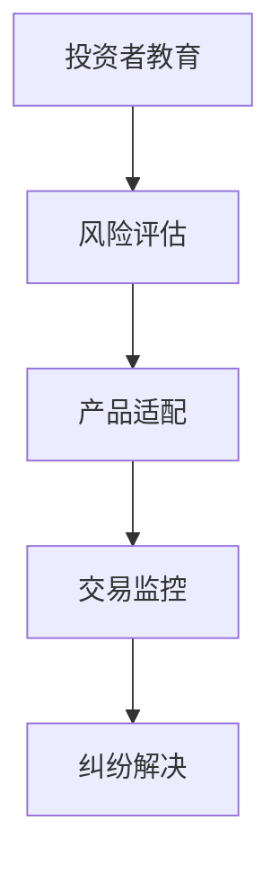

# 英国FCA新规即将生效，OKX用户需注意这些重要变化

## 重大调整：英国用户投资加密资产需通过专业评估

根据英国金融行为监管局（FCA）最新发布的监管要求，自2024年1月8日起，OKX将对英国新老零售用户实施全新的合规流程。这项政策调整不仅标志着英国加密货币市场正式纳入传统金融监管框架，更为全球数字资产合规化发展树立了重要标杆。

### 用户分类与风险认知双验证机制

为全面贯彻《金融促销监管制度》要求，OKX将实施双重审核机制：

1. **投资者分类评估**
   通过系统化的问卷调查，精准划分用户投资属性，重点验证用户对加密资产风险的认知水平。评估维度包括：
   - 投资经验年限
   - 风险承受能力
   - 金融产品理解度

2. **适当性评估体系**
   深度考察用户对加密资产的专业认知，具体包含：
   | 评估维度       | 考核重点                     |
   |----------------|----------------------------|
   | 市场波动认知   | 历史价格波动规律解读能力     |
   | 技术原理理解   | 区块链技术基础概念掌握程度   |
   | 风险管理意识   | 止损策略与仓位管理认知       |

👉 [立即了解合规流程细节](https://bit.ly/okx_welcome)

### 合规化发展背后的行业深意

这项监管变革不仅关乎OKX平台本身，更折射出加密货币市场走向成熟的关键转折：
- **风险教育升级**：要求平台主动承担投资者教育职责
- **产品推广规范**：禁止误导性宣传，强调风险透明化
- **服务标准统一**：建立与传统金融机构同等的服务规范

正如OKX首席合规官在公开声明中强调："我们始终认为，负责任的交易不仅需要技术创新，更需要风险意识的同步提升。"

### 常见问题解答（FAQ）

**Q：为什么需要同时完成两项评估？**  
A：双重验证机制旨在建立更立体的用户画像，既确保投资者具备基本风险认知，又能准确匹配其投资能力与产品风险等级。

**Q：评估未通过会有什么影响？**  
A：根据FCA规定，未能通过适当性评估的用户将暂时无法进行加密资产交易，但可保留账户进行基础学习与研究。

**Q：现有用户需要重新评估吗？**  
A：是的，所有英国用户（含现有账户）均需在2024年1月8日前完成最新评估，这是FCA合规的强制性要求。

👉 [查看完整评估指南](https://bit.ly/okx_welcome)

### 责任交易生态的三大支柱

OKX构建的负责任交易体系已形成三大核心模块：

1. **自主研究能力培养**
   - 提供专业分析工具包
   - 定期发布市场研究报告
   - 开设区块链技术公开课

2. **交易纪律建设**
   - 智能提醒系统：设置个性化交易提醒
   - 模拟交易平台：零风险实践环境
   - 交易日志系统：自动记录交易决策过程

3. **风险管理体系**
   - 多维度风险评估模型
   - 动态保证金管理系统
   - 极端行情应急预案

### 新规带来的行业启示

FCA新规实施将引发连锁反应：
1. **市场结构优化**：淘汰不合规平台，提升行业集中度
2. **用户结构升级**：专业投资者比例预计提升40%
3. **产品创新加速**：合规衍生品开发进入快车道

👉 [获取最新市场趋势分析](https://bit.ly/okx_welcome)

### 投资者保护机制全景图

OKX已构建五层防护体系：

这种全周期防护机制既满足FCA监管要求，又为用户提供了实质性的保护措施。

### 合规时代的投资建议

面对新监管环境，投资者可采取以下策略：
- 建立3-6个月学习期，重点研究FCA认证的教育材料
- 制定详细的风险管理计划，包含止损、止盈和仓位管理方案
- 定期参与平台组织的合规投资培训课程
- 利用模拟交易系统测试交易策略的有效性

### 行业影响深度解析

FCA新规的实施将带来三大结构性变革：
1. **投资者门槛提升**：预计散户参与率将下降25%-30%
2. **机构化进程加速**：专业机构投资者占比可能突破60%
3. **合规成本增加**：平台年均合规支出预计增加1500-2000万英镑

这些变化既带来短期阵痛，也为行业长期健康发展奠定基础。

### 展望未来：合规化发展的三大趋势

1. **全球监管协同**：各国监管机构加强跨境协作
2. **技术合规创新**：区块链技术应用于监管合规场景
3. **投资者分级管理**：建立精细化的用户管理体系

正如行业观察家指出的："加密货币市场的合规化进程，本质是传统金融基础设施与区块链技术创新的深度耦合。"

通过这次合规升级，OKX不仅展示了头部交易所的社会责任担当，更为行业树立了合规创新的典范。在风险与机遇并存的新阶段，投资者更需要提升专业素养，理性参与市场。